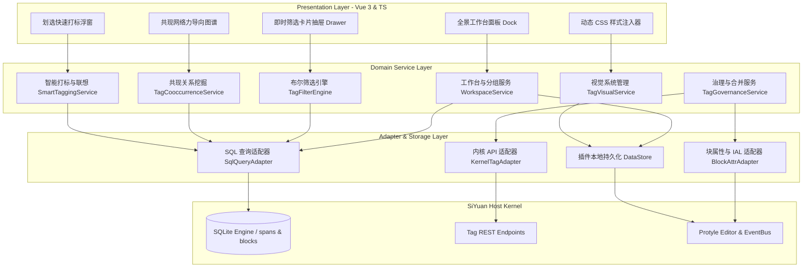
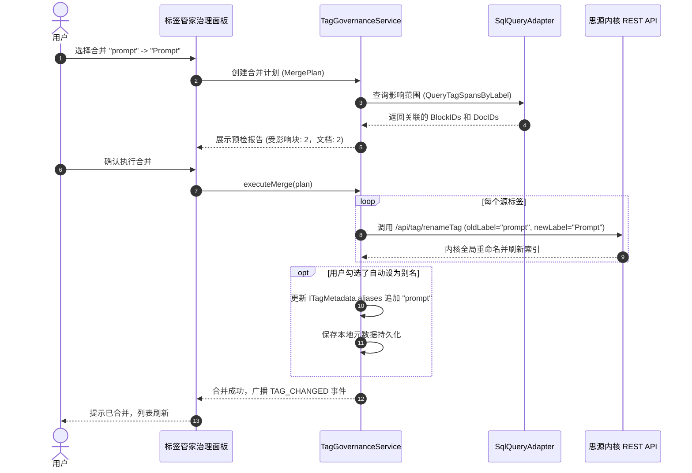

# “标签管家 (Tag Manager)” 插件系统架构与详细设计方案

## 1. 架构总览与设计原则

“标签管家”是面向思源笔记（SiYuan Note）的专业级标签资产治理与增强检索插件。本插件采用**完全解耦、零侵入内核、响应式驱动**的设计架构，充分利用思源笔记的开放扩展能力。

### 1.1 核心设计原则

1. **零侵入与强兼容性**：
   * 不修改思源笔记内核源码，严格基于官方 REST API（`/api/query/sql`、`/api/tag/renameTag`、`/api/tag/removeTag`、`/api/attr/setBlockAttrs`）与前端 Protyle 事件总线。
2. **轻量防打断交互**：
   * 提供原生级侧边栏 Dock 面板与侧边轻量卡片抽屉（Drawer），杜绝点击标签强制弹窗破坏阅读思路。
3. **高效增量缓存与虚拟化**：
   * 面对 5,000+ 标签、100,000+ 关联块的大型知识库，采用前端虚拟列表（Virtual Scroll）与增量 SQL 索引，确保毫秒级响应。
4. **原生设计美学融合**：
   * 采用与思源官方一致的 B3CSS 规范、CSS 自定义属性变量与 SVG 图标系统，保持视觉与交互无缝融合。

---

## 2. 系统分层架构

系统划分为**表现层（Presentation）**、**服务层（Domain Service）**、**数据与适配层（Adapter & Data）**及**宿主内核层（SiYuan Host）**：



---

## 3. 核心数据结构与接口定义 (TypeScript)

为扩展原生标签无法挂载属性的问题，插件在本地存储（`plugin.loadData` / `saveData`）中维护轻量元数据表：

### 3.1 标签元数据接口 (ITagMetadata)

```typescript
/**
 * 标签元数据配置接口
 */
export interface ITagMetadata {
  /** 标签唯一标识 (完整标签全路径，如 "tech/python" 或 "Prompt") */
  label: string;
  /** 自定义显示别名 (用于拼音联想与别名展示) */
  aliases?: string[];
  /** 标签背景颜色 (十六进制或 CSS 变量，如 "#E8F0FE") */
  backgroundColor?: string;
  /** 标签字体颜色 (如 "#1A73E8") */
  textColor?: string;
  /** 自定义图标 (Emoji 字符或 SVG 图标名称) */
  icon?: string;
  /** 标签所属自定义分组 ID (如 "group_work") */
  groupId?: string;
  /** 标签业务描述或 Wiki 解释 */
  description?: string;
  /** 是否收藏置顶在面板顶部 */
  isPinned?: boolean;
  /** 排序权重 (数字越大越靠前) */
  pinnedOrder?: number;
  /** 元数据更新时间戳 */
  updatedAt: number;
}
```

### 3.2 标签分组接口 (ITagGroup)

```typescript
/**
 * 标签分类分组接口 (用于在面板上进行主题归类)
 */
export interface ITagGroup {
  /** 分组唯一 ID */
  id: string;
  /** 分组显示名称 (如 "技术栈"、"待办状态"、"创作主题") */
  name: string;
  /** 分组展示颜色 */
  color?: string;
  /** 包含的标签路径前缀或特定标签列表 */
  matchRules: {
    /** 按前缀匹配，如 "tech/" 匹配所有子标签 */
    prefix?: string[];
    /** 精确匹配标签全名 */
    exactLabels?: string[];
  };
  /** 分组在面板上的排序序号 */
  sortOrder: number;
}
```

### 3.3 智能保存视图接口 (ISmartTagView)

```typescript
/**
 * 智能标签过滤视图 (保存常用多维筛选条件)
 */
export interface ISmartTagView {
  /** 视图唯一 ID */
  id: string;
  /** 视图名称 (如 "待处理的高优先级需求") */
  title: string;
  /** 包含标签 (AND 逻辑) */
  includeTags: string[];
  /** 排除标签 (NOT 逻辑) */
  excludeTags: string[];
  /** 可选标签 (OR 逻辑) */
  optionalTags: string[];
  /** 限定查询的笔记本 ID 列表 (空表示全库) */
  notebookIds?: string[];
  /** 限定查询的文档根路径 */
  rootDocPath?: string;
  /** 结果呈现方式: "card" 卡片流 | "compact" 紧凑列表 | "table" 表格 */
  displayMode: 'card' | 'compact' | 'table';
  /** 创建时间戳 */
  createdAt: number;
}
```

### 3.4 标签合并计划接口 (ITagMergePlan)

```typescript
/**
 * 标签合并与重构执行计划
 */
export interface ITagMergePlan {
  /** 目标保留标签名 (如 "Prompt") */
  targetLabel: string;
  /** 待吸收合并的源标签列表 (如 ["prompt", "Prompt工程", "提示词"]) */
  sourceLabels: string[];
  /** 影响的文档总数 (预检估算) */
  affectedDocCount: number;
  /** 影响的块总数 (预检估算) */
  affectedBlockCount: number;
  /** 是否在合并后自动将源标签设置为目标标签的 Alias 别名 */
  setAsAliasAfterMerge: boolean;
}
```

---

## 4. 关键业务流程与详细设计

### 4.1 智能标签合并（Tag Merge）全局执行流

解决截图中的 `Prompt (23)` 与 `prompt (2)` 大小写割裂问题：



---

### 4.2 零侵入动态视觉注入系统（Tag Styler）

思源编辑器基于 Protyle 渲染引擎，标签在 HTML 中渲染为带有 `data-type="tag"` 的 `<span>` 元素：
```html
<span data-type="tag" class="protyle-attr--tag">#YouTube#</span>
```

#### 注入实现方案：
1. `TagVisualService` 在插件初始化时，在思源主界面动态插入一个独立 `<style id="siyuan-tag-styler">` 标签。
2. 监听标签元数据配置变更，实时生成基于属性选择器的 CSS 规则：
```css
/* 自动生成的动态样式示例 */
span[data-type~="tag"]:has-text("#YouTube#"),
span[data-type~="tag"][data-content="YouTube"] {
    background-color: rgba(255, 0, 0, 0.12) !important;
    color: #e50914 !important;
    border-radius: 4px;
    padding: 1px 6px;
    font-weight: 500;
}
span[data-type~="tag"]:has-text("#YouTube#")::before {
    content: "🎬 ";
    font-size: 0.9em;
}
```
3. 此机制**无需触碰任何 Markdown 底层文档数据**，完全在渲染层实现美化，换设备或停用插件不会产生脏数据。

---

### 4.3 多维布尔筛选引擎与即时卡片抽屉 (Faceted Filter & Inline Drawer)

替代原生点击标签后生硬弹出全局搜索大窗口的体验：

1. **布尔状态机**：
   * 标签芯片（Tag Chip）拥有 3 种状态：
     * `Neutral`（中立无状态）：默认不参与过滤；
     * `Include`（与 / 必含，状态值 `+`，高亮浅蓝）：生成 `AND content LIKE '%#tag#%'`；
     * `Exclude`（非 / 排除，状态值 `-`，红色划线）：生成 `AND content NOT LIKE '%#tag#%'`。
2. **SQL 动态组装引擎**：
   * 利用思源公开的高性能 `/api/query/sql` 接口，组装高效复合查询语句：
```sql
SELECT b.id, b.content, b.markdown, b.root_id, b.updated, d.content as doc_title
FROM blocks b
LEFT JOIN blocks d ON b.root_id = d.id
WHERE b.type NOT IN ('d')
  -- 必含标签条件
  AND b.id IN (SELECT block_id FROM spans WHERE type LIKE '%tag%' AND content = 'YouTube')
  AND b.id IN (SELECT block_id FROM spans WHERE type LIKE '%tag%' AND content = 'Prompt')
  -- 排除标签条件
  AND b.id NOT IN (SELECT block_id FROM spans WHERE type LIKE '%tag%' AND content = '基础教程')
ORDER BY b.updated DESC
LIMIT 50 OFFSET 0;
```
3. **原地卡片抽屉展示**：
   * 筛选结果以平滑动画在工作区右侧滑出抽屉或挂载在侧栏 Dock 下方，卡片高亮匹配词与上下文，点击卡片直接调用思源 Protyle 跳转并聚焦，完全保留用户当前的阅读视窗。

---

### 4.4 标签共现网络图谱计算模型 (Co-occurrence Engine)

用于发掘知识库中隐式的跨主题关联：

1. **共现算法逻辑**：
   * 遍历所有命中标签的块及同文档内相邻块，构建对称邻接矩阵：
     $$C(T_i, T_j) = \sum \text{Count}(\text{Block 包含 } T_i \land T_j)$$
2. **Jaccard 关联相似度计算**：
   $$J(T_i, T_j) = \frac{|T_i \cap T_j|}{|T_i \cup T_j|}$$
3. **图谱输出格式**：
   * 节点（Nodes）：标签名、引用频次（对应节点半径大小）、分组颜色。
   * 边（Edges）：两标签共现次数（对应边粗细与距离弹性系数），直接接入轻量级 Force-Graph 渲染。

---

## 5. 性能保障与大数据量优化策略

针对包含上万条笔记的大型知识库：

1. **分批分页与虚拟滚动（Virtual Scrolling）**：
   * 工作台列表和筛选结果卡片全部引入 Vue 虚拟滚动容器，DOM 节点数量恒定在 30 个以内，杜绝卡顿。
2. **标签索引内存快照（In-memory Index Snapshot）**：
   * 插件在加载时一次性通过轻量 SQL 聚合全库标签清单（耗时约 30~50ms），保存在内存 Map 中。用户在过滤搜索时基于内存计算，输入响应时间低于 16ms（60fps 丝滑响应）。
3. **后台更新防抖与脏标记**：
   * 监听思源的 `ws-main` 事件，仅在发生块内容修改或事务提交时延迟 500ms（Debounce）增量刷新脏数据，避免打字时频繁请求内核。
