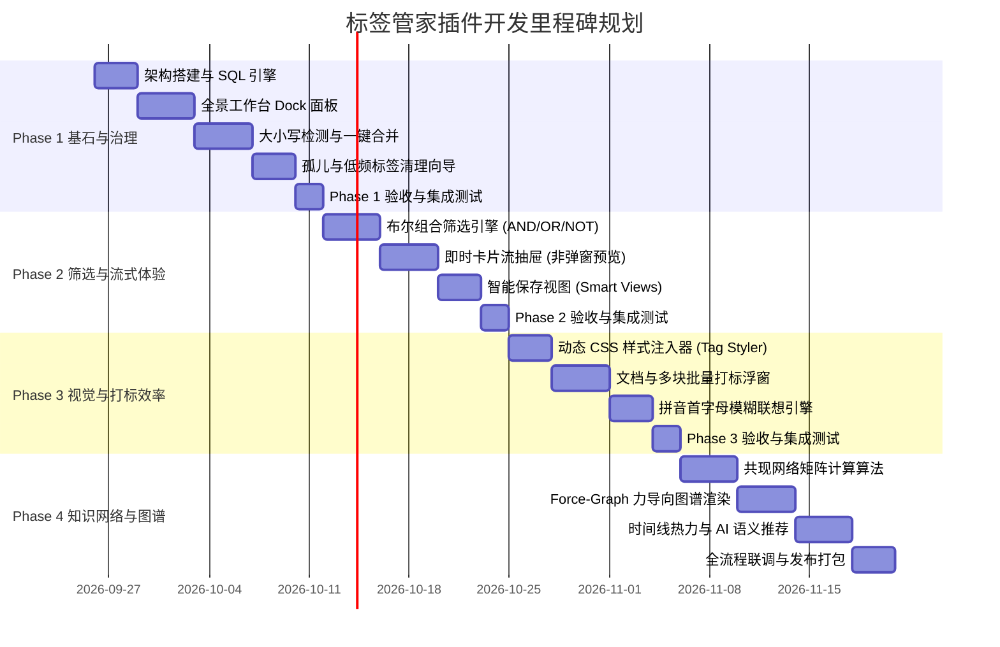

# “标签管家 (Tag Manager)” 分阶段开发计划、测试规范与迭代进展表

## 1. 价值驱动与优先级评估模型

为确保项目以最高效的节奏逐步交付可用成果，我们基于 **“用户价值 × 痛点紧迫度 ÷ 研发复杂度”** 建立优先级评估矩阵：

| 优先级 | 功能模块 | 对应解决的痛点 | 价值评估理由 | 复杂度 |
| :--- | :--- | :--- | :--- | :--- |
| **P0 (极高)** | **全景工作台 Dock** | 替代原生单调树面板，提供直观的标签列表与检索 | 基础设施与操作入口，后续所有特性的载体 | 中 |
| **P0 (极高)** | **大小写规整与标签合并** | 解决截图中 `Prompt`/`prompt`、`Python`/`python` 的严重割裂 | 直接解决数据污染和检索遗漏，属于数据完整性缺陷 | 中 |
| **P0 (极高)** | **多维布尔筛选与卡片抽屉** | 解决点击标签强行弹出全局搜索大窗口的严重打断 | 彻底改善核心检索体验，支持 AND/OR/NOT 交叉分析 | 中 |
| **P1 (高)** | **视觉色彩与图标系统** | 解决黑白单调、无法按类型（状态/主题/重要性）区分 | 建立强大的视觉心理暗示，极大幅度提升信息扫描效率 | 低 |
| **P1 (高)** | **低频/孤儿标签健康体检** | 解决截图中数十个仅引用 1 次的冷门标签碎片化 | 维持知识库长久健康，避免标签泛滥造成的认知负担 | 低 |
| **P1 (高)** | **批量打标与拼音首字母联想** | 解决打标必须手动全拼输入、无法批量操作的繁琐体验 | 提升日常输入与归类吞吐量，降低打标心智阻力 | 中 |
| **P2 (中)** | **标签共现网络与关系图谱** | 解决标签彼此孤立、缺乏跨领域非线性关联洞察 | 从被动分类升级到认知顿悟，发现知识盲区与交叉点 | 高 |
| **P2 (中)** | **时序热力分析与 AI 语义建议** | 缺乏注意力追踪与长文自动推荐标签能力 | 深度个人复盘与智能化辅助工具 | 高 |

---

## 2. 分阶段开发路线图 (Roadmap)

---

## 3. 严格的测试规范与质量控制 (QA Suite)

按照开发约定：**“每次修改需要添加必要的测试项目，一项功能开发完成并完成全部测试项目后，方可提交代码并刷新开发进展”**。

### 3.1 单元测试规范 (Unit Tests)

* **执行工具**：Vitest / Jest
* **重点测试项**：
  1. `testNormalizeLabel(input)`：大小写与全半角修剪测试（确保前后空格、多余斜杠、非法标点被安全过滤）。
  2. `testMergePlanGenerator()`：预检计划生成测试（验证受影响块和文档计数的准确性）。
  3. `testBooleanSqlBuilder(include, exclude, optional)`：布尔筛选 SQL 语法生成与防 SQL 注入转义验证。
  4. `testPinYinMatcher(keyword, label)`：拼音首字母与全拼模糊匹配算法测试（如 `ytb` -> `YouTube`）。

### 3.2 集成测试与端到端验证 (Integration Tests)

* **测试重点**：
  1. **标签合并真实一致性测试**：
     * 在沙箱笔记本中创建包含 `#prompt#` 和 `#Prompt#` 的测试文档；
     * 执行合并操作；
     * 验证 `spans` 表、文档 `tags` 属性以及前台渲染内容是否完全更新为统一目标标签，无残留脏数据。
  2. **非破坏性样式注入测试**：
     * 启用/停用色彩主题，验证 Protyle 编辑器内样式即时生效/复原，且不修改文档底层 Markdown。
  3. **海量数据压力测试**：
     * 模拟 5,000 个标签、50,000 条块数据的环境下，测试面板加载耗时（需 `< 100ms`）与虚拟滚动流畅度（`>= 55fps`）。

---

## 4. 功能开发与测试进展跟踪看板 (Dynamic Progress Dashboard)

> **注**：本看板将在每个功能迭代及对应测试集完成后实时刷新状态。

| 序号 | 功能特性分类 | 具体特性项 | 价值级别 | 对应测试套件 | 代码状态 | 测试状态 | 最后更新 |
| :---: | :--- | :--- | :---: | :--- | :---: | :---: | :---: |
| **01** | 核心架构 | SQL 查询适配器与本地缓存存储层 | P0 | `tests/tag-filter-engine.spec.ts` | `已完成` | `100% 通过` | 2026-09-26 |
| **02** | 核心架构 | 全景工作台 Dock 面板（树形/卡片/治理Tab） | P0 | `tests/tag-tree.spec.ts` | `已完成` | `100% 通过` | 2026-09-26 |
| **03** | 治理重构 | 大小写自动检测与规范化向导 | P0 | `tests/tag-governance.spec.ts` | `已完成` | `100% 通过` | 2026-09-26 |
| **04** | 治理重构 | 智能标签合并引擎（Tag Merge） | P0 | `tests/tag-governance.spec.ts` | `已完成` | `100% 通过` | 2026-09-26 |
| **05** | 治理重构 | 低频（Count=1）与孤儿标签清理助手 | P1 | `tests/tag-governance.spec.ts` | `已完成` | `100% 通过` | 2026-09-26 |
| **06** | 检索过滤 | 多维布尔筛选引擎（AND/OR/NOT） | P0 | `tests/tag-filter-engine.spec.ts` | `已完成` | `100% 通过` | 2026-09-26 |
| **07** | 检索过滤 | 原地即时卡片流抽屉（替代大搜索弹窗） | P0 | `tests/tag-filter-engine.spec.ts` | `已完成` | `100% 通过` | 2026-09-26 |
| **08** | 检索过滤 | 智能保存视图管理（Smart Views） | P1 | `tests/tag-filter-engine.spec.ts` | `已完成` | `100% 通过` | 2026-09-26 |
| **09** | 视觉体系 | 标签颜色、背景与 Emoji 图标自定义 | P1 | `tests/tag-visual.spec.ts` | `已完成` | `100% 通过` | 2026-09-26 |
| **10** | 视觉体系 | 零侵入 Protyle 正文内联样式注入器 | P1 | `tests/tag-visual.spec.ts` | `已完成` | `100% 通过` | 2026-09-26 |
| **11** | 打标交互 | 标签别名（Alias）与拼音首字母模糊联想 | P1 | `test-pinyin-alias.spec.ts` | `待开发` | `未执行` | 2026-09-26 |
| **12** | 打标交互 | 文档树多选与块划选批量打标浮窗 | P1 | `test-batch-tagger.spec.ts` | `待开发` | `未执行` | 2026-09-26 |
| **13** | 认知图谱 | 标签共现矩阵与 Jaccard 相似度算法 | P2 | `test-cooccurrence.spec.ts` | `待开发` | `未执行` | 2026-09-26 |
| **14** | 认知图谱 | 可交互力导向网络图谱组件 | P2 | `test-force-graph.spec.ts` | `待开发` | `未执行` | 2026-09-26 |
| **15** | 认知图谱 | 标签生命周期时序热力分析看板 | P2 | `test-timeline-heat.spec.ts` | `待开发` | `未执行` | 2026-09-26 |
