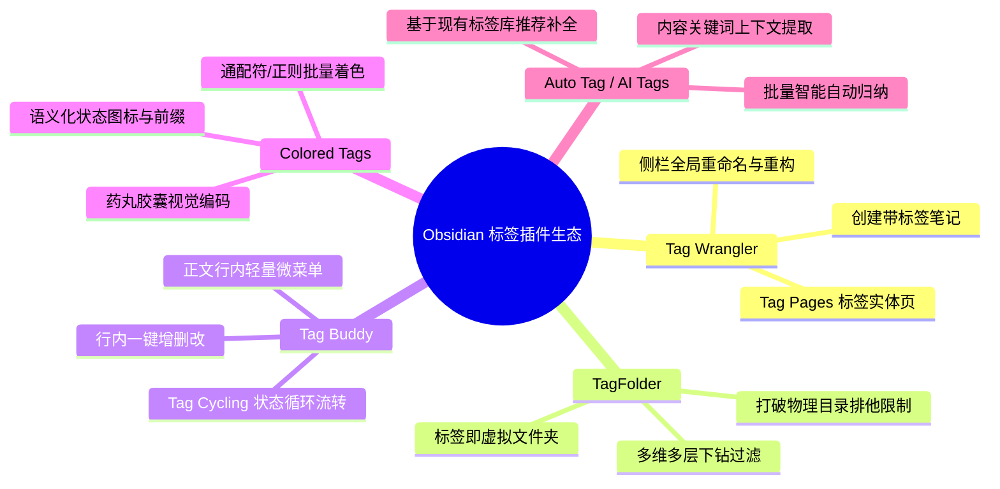
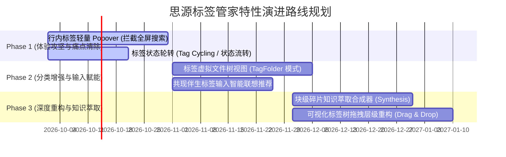

# 思源笔记标签管家 · Obsidian 标签生态深度对比与特性演进规划

> **文档定位**：本规划文档基于个人知识库管理系统（PKMS）的核心认知演进逻辑，深度剖析 Obsidian 社区前沿标签插件的优秀设计哲学；结合思源笔记（SiYuan Note）特有的**块级模型（Block-level Architecture）**与用户日常记笔记的**真实全生命周期痛点**，全面对比当前插件功能边界，制定出具备高度可行性与高用户价值的特性演进路线图。

---

## 1. 调研背景与 Obsidian 生态标杆插件深度剖析

在个人知识管理（PKM）领域，标签（Tags）是连接发散思维与结构化收纳的桥梁。Obsidian 作为纯 Markdown 文件系统的代表，其庞大的插件社区诞生了多个千万级下载的明星标签插件，每一个都代表了用户在特定工作流场景下的强烈诉求：



### 1.1 Tag Wrangler（作者：pjeby · 生态级基石）
- **核心定位**：补足原生侧边栏“只能查看和过滤，无法重命名和管理”的系统级硬伤。
- **解决痛点**：原生修改标签名需要全库正则查找替换，极易改坏或遗漏父子层级。
- **代表特性**：
  1. **级联重构重命名**：在侧栏右键重命名父标签，其下所有形如 `#parent/child/grandchild` 的嵌套子标签同步原子更新；
  2. **快速建档**：右键任意标签，一键在默认目录“新建已包含该标签的笔记”；
  3. **Tag Pages（标签文档绑定）**：将标签关联到一篇实体笔记，在侧栏中点击标签可直达该标签的说明文档。

### 1.2 TagFolder（作者：vrtmrz · 颠覆性虚拟文件系统）
- **核心定位**：打破传统文件系统“一篇笔记只能归属于一个物理文件夹”的排他性约束。
- **解决痛点**：用户常常纠结于“这篇文章到底该放进《项目》还是《技术》还是《会议》目录”。
- **代表特性**：
  1. **标签即虚拟目录**：将标签树直接渲染为类操作系统的文件资源管理器；
  2. **多维交织浏览**：一篇打有 `#前端`、`#Vue`、`#电商项目` 的笔记，会同时出现在这三个标签虚拟目录下；
  3. **交叉级联目录**：展开某个标签后，子级动态展示与之并存的伴生标签目录，支持按层级不断下钻缩小范围。

### 1.3 Tag Buddy（作者：Joshua Blais · 行内即时交互神器）
- **核心定位**：免去繁琐打字，让正文内的标签操作获得类似 Todo 复选框的即时反馈。
- **解决痛点**：在正文中修改已有标签或调整状态时，需要精准选中文本、退格重输，移动端尤其痛苦。
- **代表特性**：
  1. **行内微气泡**：鼠标悬停或点击行内标签时，就地弹出迷你菜单，无需跳出当前行；
  2. **Tag Cycling（标签轮转循环）**：预设状态序列（如 `#todo` ➔ `#doing` ➔ `#done`），点击一次自动原地轮转替换为下一个状态；
  3. **快捷加标**：快速在当前标签旁追加兄弟标签，无需重复敲击 `#` 键。

### 1.4 Colored Tags & Supercharged Links
- **核心定位**：为纯文本标签赋予视觉层级与状态语义。
- **解决痛点**：成百上千个标签在界面中一律呈现单调灰色/蓝底，无法直观区分哪些是“紧急度”、哪些是“技术栈”、哪些是“生命周期”。
- **代表特性**：
  1. 颜色与前缀图标规则引擎（如匹配 `#status/*` 统一为药丸徽章，`#status/done` 自动追加绿色对勾）；
  2. 多主题（暗黑/明亮）色值自适应。

---

## 2. 三方能力横向对比全景矩阵

| 评估维度 | 思源笔记原生机制 | Obsidian 插件生态主流方案 | 🏷️ siyuan-tag-manager (当前版本) | 综合评级与演进指引 |
| :--- | :--- | :--- | :--- | :--- |
| **标签资产检索** | 仅单次前缀检索，不支持拼音 | 检索依赖第三方，原生仅英文过滤 | **全拼、首字母简拼（如 `ytb`）模糊匹配，多维排序** | 🥇 **本插件领先**<br>拼音首字母检索体验极佳 |
| **多维组合筛选** | 不支持（需手动编写多表 SQL） | 依赖 Dataview/Tracker 脚本编写 | **可视化点选 AND / OR / NOT + 卡片流秒级直达** | 🥇 **本插件领先**<br>零学习成本，沉浸式抽屉交互 |
| **健康体检与治理** | 完全缺失 | 仅 Tag Wrangler 支持单次被动重命名 | **全库健康评分、大小写冲突一键合并、孤儿/低频治理** | 🥇 **本插件独有壁垒**<br>业界领先的系统级自动化治理 |
| **认知关系挖掘** | 完全缺失 | Graph Analysis 支持全局图谱 | **Jaccard 相似度伴生挖掘、同现关系网络** | 🥇 **本插件领先**<br>精准聚焦标签层面的知识关联 |
| **行内交互体验** | 点击强行打开全屏全局搜索（**严重打断心流**） | Tag Buddy 支持行内轻量菜单与状态轮转 | 已支持 Protyle 正文彩色高亮与图标注入，**但点击仍未接管原生全屏弹窗** | ⚠️ **存在关键升级空间**<br>需打造行内 Popover |
| **层级重构能力** | 仅支持单标签重命名 | Tag Wrangler 支持级联重命名 | 支持重命名与合并，但**尚不支持在树上直接拖拽调整父子关系** | ⚠️ **存在关键升级空间**<br>需引入拖拽交互 (Drag & Drop) |
| **虚拟文件树浏览** | 仅能查看计数，无法展开文档 | TagFolder 支持将标签渲染为虚拟文件树 | 资产树仅展示标签自身，文档在筛选卡片流中呈现 | ⚠️ **存在关键升级空间**<br>可扩展“标签即文件夹”直接浏览 |
| **标签知识主控页** | 无原生概念 | Tag Pages 为标签绑定实体说明文档 | 已有升格主题文档，但**与标签缺乏持久双向绑定与动态同步** | ⚠️ **存在关键升级空间**<br>需升级为双向 Tag Hub / MOC |
| **块级碎片萃取** | 仅支持原生复杂嵌入块语法 | 依赖 DataviewJS 手写查询脚本 | 支持多维卡片流预览与跳转定位 | ⚠️ **存在独特护城河空间**<br>块级碎片一键导出为综述文档 |

---

## 3. 思源笔记独特优势与用户日常记笔记痛点挖掘

### 3.1 思源特有的块级（Block-level）护城河
在 Obsidian 中，核心实体是 Markdown 文本文件（File），行内标签仅是文本扫描结果；而在思源笔记中，**一切皆块（Block）**，每个段落、标题、待办列表、代码块、甚至表格都拥有全局唯一的 `block_id` 并直接挂载在底层 SQLite 数据库中。

这意味着在思源中做标签管理，拥有远超 Obsidian 的**颗粒度精准度与查询效率**：
1. **秒级聚合**：无需遍历成千上万个 Markdown 文本文件，SQL 索引纳秒级响应；
2. **块级反向链接**：一个标签不仅对应一篇文章，而是精准锚定到某本书的一个段落、某次会议的一条决定；
3. **块嵌入与引用生态**：打标块可以直接通过 `((block-id))` 被其他文档引用或嵌入，天生具备“知识乐高”重构能力。

### 3.2 用户日常记笔记的 6 大真实痛点

```
[记笔记全生命周期]
  │
  ├─ 1. 写作输入期 ─── 痛点：打标摩擦阻力大、遗忘已有命名规范、重复造轮子
  ├─ 2. 阅读心流期 ─── 痛点：点击行内标签粗暴弹全屏，打断上下文心流
  ├─ 3. 任务与状态 ─── 痛点：GTD/状态流转需手动改文本，操作繁琐
  ├─ 4. 知识分类期 ─── 痛点：物理文件夹单向排他，多维归属无法直观翻阅
  ├─ 5. 体系成长重构 ─ 痛点：标签层级膨胀后，调整父子归类畏难弃疗
  └─ 6. 知识输出期 ─── 痛点：散落全库的碎片打标段落，无法一键萃取为成稿
```

---

## 4. 六大高价值杀手级特性详细规划

### 特性一：行内标签轻量浮动 Popover（终结原生全屏打断）

#### 1. 痛点背景
在思源笔记正文中阅读或写作时，如果不小心或想查看某个 `#标签#`，思源原生交互是**直接强制弹出一个全屏/半屏的“全局搜索”窗口**（搜索词填入 `#标签#`），完全遮挡了当前正在阅读的上下文。用户反馈此体验“极度刺眼且打断心流”。

#### 2. 功能设计与交互规格
- **事件接管**：在 Protyle 编辑器中，通过事件委托监听 `span[data-type~="tag"]` 的 `click` 与 `mouseenter` 事件，阻止思源默认的 `open-search` 全局弹窗；
- **轻量 Popover 悬浮浮窗**：
  - **顶部**：当前标签全称、引用总数、已绑定色盘胶囊；
  - **快捷块摘要（Mini Stream）**：实时展示该标签下最新匹配的 3 条上下文块缩略卡片，点击直接悬浮预览或在小窗打开，保持主文档阅读位置不变；
  - **操作工具栏**：
    - `[在侧边栏卡片流展开]`：在右侧/抽屉 Tag Manager 中完整打开筛选视图；
    - `[加入组合筛选 (+AND)]`：直接将该标签追加到当前多维筛选条件池；
    - `[快速重命名 / 改色]`：就地打开调色板弹窗；
    - `[进入标签主控页]`（若已绑定 MOC）。

```
+-------------------------------------------------------+
|  🏷️ #技术/Vue3#  (共 28 处引用)             [侧栏展开] |
+-------------------------------------------------------+
|  📄 《前端工程架构实践》                              |
|     ...在进行 Pinia 状态树迁移时，需要注意...          |
|  📄 《2025 年技术复盘》                               |
|     ...组件通信全面转向 Composition API...            |
+-------------------------------------------------------+
|  [⚡加入筛选]  [🎨定制色彩]  [🔄流转状态]  [📖打开主控页]  |
+-------------------------------------------------------+
```

---

### 特性二：基于共现图谱的“伴生标签智能推荐”（输入态前置赋能）

#### 1. 痛点背景
用户在日常随手记笔记时，常常面临**“打标冷启动难题”**：打了 `#React#` 忘记加 `#前端#`，打了 `#书籍摘要#` 忘记标所属领域；或者想不起之前用的是 `#AI#` 还是 `#人工智能#`。目前共现图谱仅停留在事后分析 Tab，未能在“输入打标的当下”发挥价值。

#### 2. 功能设计与交互规格
- **触发机制**：
  1. 当用户在编辑器输入完标签（检测到闭合 `#`）时；
  2. 或者光标移动至已存在标签的块时；
- **智能联想推荐浮条（Tag Companion Bar）**：
  - 自动调用后台现有的 `TagCooccurrenceService`，分析与当前标签 Jaccard 相似度最高的前 3~5 个高频伴生标签；
  - 在当前块下方或行内以半透明胶囊展现：
    > 💡 **伴生推荐**：`#前端工程化#` (88%)、`#TypeScript#` (72%)、`#状态管理#` (55%)
  - **极简交互**：用户按下 `Tab` 键依次采纳，或鼠标单击直接在当前块光标后一键追加打标。

---

### 特性三：标签状态轮转与流水线（Tag State Cycling）

#### 1. 痛点背景
大量知识工作者使用标签做轻量级状态追踪与 GTD 工作流，例如：
- 任务流水线：`#status/todo` ➔ `#status/doing` ➔ `#status/done`
- 认知沉淀流：`#知识/闪念` ➔ `#知识/整理` ➔ `#知识/常青`
- 优先级管理：`#P2` ➔ `#P1` ➔ `#P0`
在传统笔记中，每次状态流转必须手动选中文本、删除原标签、重新打出新标签，操作步骤极多，阻碍了习惯的养成。

#### 2. 功能设计与交互规格
- **状态流水线配置（Settings）**：
  用户可自定义任意数量的状态组（单选互斥流水线），例如：
  `reading_pipeline = ['待读', '精读中', '已消化', '已归档']`
- **双重无缝轮转交互**：
  1. **正文行内轮转**：
     - 在行内标签 Popover 中点击“流转状态”按钮；
     - 或按住快捷修饰键（如 `Alt + 单击标签`），标签内容原地无缝轮转至下一个状态（同时更新 DOM 样式与色彩）；
  2. **卡片流下拉流转**：
     - 在 `TagFilterView` 筛选出的卡片上，如果检测到块包含状态标签，直接在卡片操作栏渲染为下拉切换框（Dropdown），无需点进文档即可快速推进任务状态。

---

### 特性四：标签虚拟文件树视图（TagFolder 模式）

#### 1. 痛点背景
思源笔记原生的文档树是刚性的树形物理结构，一篇文章只能位于一个固定的笔记本和子文档下。但知识本质是立体的，一篇笔记可能同时兼具 `#读书笔记`、`#投资理财`、`#商业模式` 三种属性。用户非常希望能够像翻看文件夹一样，按标签组织维度去翻阅笔记。

#### 2. 功能设计与交互规格
- **在 `TagTreeView` 引入“虚拟文件树浏览模式（Virtual TagFolder Mode）”**：
  - 标签节点不仅可以展开子标签，还可以展开其关联的**文档列表（Docs under this Tag）**；
  - 节点结构直观呈现：
    ```
    🏷️ #投资/商业模式# (12 篇文档)
       📁 子标签: #投资/商业模式/平台经济# (4)
       📁 子标签: #投资/商业模式/SaaS# (8)
       📄 《美团核心商业逻辑拆解》 [3处引用]
       📄 《海外 SaaS 定价模型研究》 [5处引用]
       📄 《重读创新者的窘境读书笔记》 [1处引用]
    ```
- **完全对齐系统文件树的操作习惯**：
  - **单击文档**：在右侧联动打开卡片流，高亮展示该文档内所有命中的打标块；
  - **双击文档**：直接在思源当前编辑工作区打开并聚焦该文档；
  - **文档右键菜单**：支持“从此标签移除”、“批量复制引用链接”等操作。

---

### 特性五：可视化标签层级拖拽重构（Drag & Drop Reparenting）

#### 1. 痛点背景
个人知识库是生长演化出来的。用户初期随手打了 `#React#`、`#Vue#`、`#Angular#`；随着笔记增多，需要将其统一收拢至 `#开发/前端/框架#` 下。在现有系统中，用户需要对每个子标签一个个手动重命名，一旦子层级多达数十个，极易发生畏难放弃，导致知识体系彻底失控。

#### 2. 功能设计与交互规格
- **树节点 HTML5 Drag & Drop 拖拽**：
  - 用户可直接在 `TagTreeView` 鼠标拖动任意标签节点；
  - 拖动至另一个节点上（作为子节点）或两个节点之间（同级重排）；
- **智能化路径重算与安全预检**：
  1. 系统自动计算出即将触发的级联重构路径：
     > 将 `#Vue#` 拖入 `#开发/前端#` 节点下
     > 预期生成目标路径：`#开发/前端/Vue#`
  2. 自动检测其子节点（如 `#Vue/Router`、`#Vue/Pinia`）受影响的范围；
- **全息变更预览确认框**：
  - 弹出差异对比框（Diff Modal）：明确列出受影响的标签总数、涉及文档数及块引用总计；
  - 结合 `TagBatchService`，以原子事务的方式一次性完成全库级联更新，并写入操作日志支持撤销。

---

### 特性六：块级碎片“知识萃取合成器”（发挥思源块级护城河）

#### 1. 痛点背景
这是思源笔记相对于纯文本笔记（如 Obsidian/Notion）**最为强大的核心场景**：
用户在阅读电子书、日常调研或写晨间日记时，会在有感而发的段落随手打上 `#金句#`、`#写作灵感#`、`#待验证假说#`。日积月累，库中可能散落着上百条碎片观点。当用户要写一篇专题文章或周报时，目前只能手动逐个搜索并反复复制粘贴。

#### 2. 功能设计与交互规格
- **在多维筛选视图增加“知识萃取工具栏（Synthesis Bar）”**：
  - 卡片流支持**多选模式（Checkbox Multi-select）**，可按时间、文档来源进行勾选；
  - 支持拖拽卡片调整萃取顺序（调整成稿逻辑大纲）；
- **一键知识萃取导出选项**：
  1. **模式 A：实时动态嵌入汇总页（Dynamic Embed MOC）**
     - 自动新建一篇汇总文档，将所选块以思源原生嵌入块 `{{SELECT * FROM blocks WHERE id = '...'}}` 或直接嵌入语法注入，源文档修改后汇总页自动实时联动；
  2. **模式 B：静态引用大纲综述（Static Linked Synthesis）**
     - 提取块正文内容，末尾自动附带精确的反向引用小括号双链 `((block-id))`，并按文档或日期归纳为大纲列表，一键生成读书笔记、会议纪要或周报初稿。

```
# 📚 专题综述：关于“知识工作流”的碎片萃取 (共 6 条)

## 一、 核心概念与本质定义
* 所谓个人知识管理，核心不是分类收藏，而是输出驱动与认知重组。 ((202509271420-abc1))
* 标签是多维切片，双链是神经微连接。 ((202509271501-def2))

## 二、 实践反思
* 警惕低频孤儿标签造成的标签通胀。 ((202509271510-ghi3))
```

---

## 5. 阶段演进路线与优先级评估矩阵

遵循**“先解决体验阻断 ➔ 再增强输入心流 ➔ 最终实现工作流重构”**的研发节奏：



### 综合评估矩阵

| 演进阶段 | 特性名称 | 技术复杂度 | 解决痛点严重度 | 用户使用频率 | 综合 ROI (投入产出比) |
| :--- | :--- | :---: | :---: | :---: | :---: |
| **Phase 1** | **行内标签轻量 Popover** | 中 | 🔴 **极高**（全屏遮挡强打断） | 每天每次阅读 | ⭐⭐⭐⭐⭐ (必做，立竿见影) |
| **Phase 1** | **标签状态轮转 (Tag Cycling)** | 低~中 | 🟠 **高**（改状态步骤繁琐） | 高频（GTD/看板用户） | ⭐⭐⭐⭐⭐ (小改动大收益) |
| **Phase 2** | **标签虚拟文件树视图** | 中 | 🟠 **高**（物理目录局限） | 高频（日常检索浏览） | ⭐⭐⭐⭐⭐ (颠覆分类心智) |
| **Phase 2** | **共现伴生标签输入推荐** | 低~中 | 🟡 **中**（打标冷启动/遗忘） | 每次打标写作 | ⭐⭐⭐⭐ (复用现有算法) |
| **Phase 3** | **块级碎片知识萃取合成器** | 中 | 🟠 **高**（碎片整理输出困难） | 中高频（复盘/出报告） | ⭐⭐⭐⭐⭐ (思源块级独特杀手锏) |
| **Phase 3** | **可视化树拖拽层级重构** | 中~高 | 🟡 **中**（阶段性大整理） | 低频但高价值 | ⭐⭐⭐⭐ (终结重构恐惧) |

---

## 6. 总结与愿景

通过对比 Obsidian 繁荣的生态实践，思源笔记的优势不仅在于桌面端与移动端开箱即用的离线本地优先架构，更在于其底层的**细粒度块级（Block-level）数据模型与原生 SQL 引擎**。

本规划使「思源标签管家」不再仅仅是一个“标签查询与体检工具”，而是升级为贯穿用户**「输入打标 ➔ 阅读心流 ➔ 状态驱动 ➔ 虚拟浏览 ➔ 架构重构 ➔ 萃取输出」**全生命周期的专业级知识资产操作系统。
