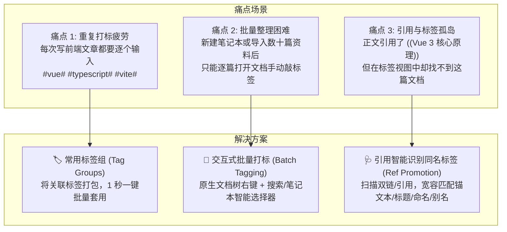
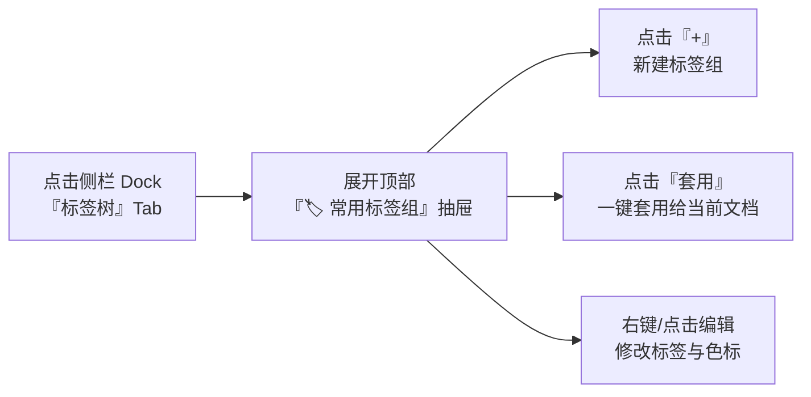
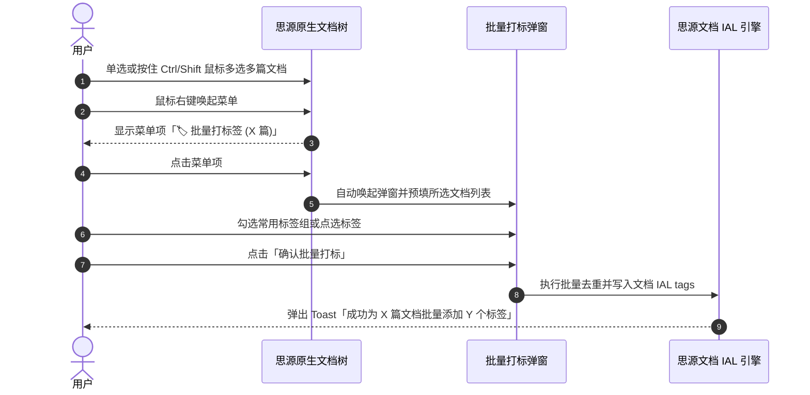
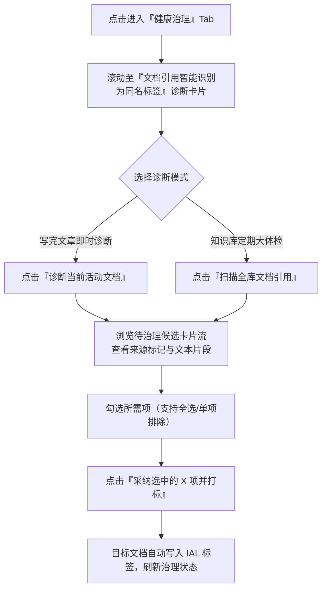

# 思源笔记标签管家 · 常用功能实战指南与使用场景

> **文档定位**：从终端用户视角出发，系统性解析「标签组（Tag Groups）」、「多文档批量打标（Batch Tagging）」与「文档引用智能识别为同名标签（Ref to Tag Promotion）」三大核心自动化治理特性的业务场景、交互设计与操作实战。  
> **适用版本**：思源笔记标签管家（siyuan-tag-manager）v0.1.0+

---

## 1. 为什么需要这些功能？（用户心智模型）

在日常使用思源笔记进行个人知识管理（PKMS）与深度写作时，我们经常遇到以下痛点：



- **心智解脱**：从“手动机械输入”走向“结构化批处理”；
- **连接孤岛**：将零散的“局部引用（双链）”与宏观的“分类体系（标签）”自然融通；
- **保持纯净**：所有文档级打标均作用于思源标准的文档属性（IAL），**绝不破坏或污染正文版式**。

---

## 2. 功能一：常用标签组（Tag Groups）

### 2.1 什么是标签组？
**标签组（Tag Group）** 允许您将若干个经常搭配出现的标签绑定为一个预设组合，并赋予其专属的**识别色标**、**组名**与**备注**。

例如：
* **前端核心技术栈**：`vue`, `typescript`, `vite`（色标：蔚蓝）
* **深度阅读笔记**：`读书笔记`, `认知科学`, `心智模型`（色标：琥珀金）
* **GTD 待办推进**：`todo`, `p0-urgent`, `本周计划`（色标：玫瑰红）

### 2.2 典型应用场景
1. **模块化写作打标**：撰写同类主题文档（如每周工作周报、技术博客、论文阅读）时，无需每次回忆并键入 3~5 个相关标签；
2. **知识资产规范化**：团队或个人统一打标颗粒度，避免漏打核心属性标签；
3. **块级快速聚焦**：在长篇文档中对某个核心段落快速打上组合标记。

### 2.3 操作指南



#### ① 新建标签组
1. 打开思源笔记标签管家侧栏（快捷键 `Alt + Shift + T` 或点击顶栏图标）；
2. 在第 1 个 Tab **「标签树」** 顶部，展开 **「🏷️ 常用标签组」** 抽屉；
3. 点击右侧的 **「+」** 按钮，弹出新建标签组对话框：
   - **选择色标**：提供 8 种高对比双主题色标（蓝、青、紫、红、琥珀、祖母绿、靛青、洋红）；
   - **填写名称**：例如 `前端开发套件`；
   - **填写备注**：例如 `Vue 3 全家桶标准技术栈`（非必填）；
   - **选择/输入标签**：
     - 在 **「从已有标签库点选」** 区域，直接点击现有标签徽章即可快速加入组；
     - 或在输入框键入新标签名，按回车 `Enter` 添加；
   - 点击 **「保存标签组」**。

#### ② 一键套用打标
* **为当前打开的文档打标**：
  - 打开正在编辑的文档；
  - 在侧栏标签组列表中，找到对应标签组，点击右侧的 **「套用」** 按钮；
  - 插件会自动将组内所有标签写入该文档的思源原生 IAL tags 属性中，右上角提示：`已为《文档名称》套用标签组「前端开发套件」(x 个标签)`；
  - *优点：专注于整篇文档的标签资产管理，正文不插入任何杂乱字符，保持笔记排版整洁干净。*

#### ③ 管理与微调
- **快捷剔除**：在标签组展示卡片中，可以直观查看包含的标签；
- **修改编辑**：点击标签组卡片右上角的编辑图标，可随时调整名称、增删标签或切换色标；
- **安全删除**：删除标签组仅删除该“组合预设”，**绝对不会删除或修改您的任何笔记与原生标签**。

---

## 3. 功能二：多文档批量打标签（Batch Tagging）

### 3.1 什么是批量打标签？
当您整理文献、重构目录或新导入了一批外部文档时，需要给几篇、几十篇甚至上百篇文档同时统一打上特定标签。传统的逐篇打开打标操作极其耗时且枯燥。

标签管家提供了**双通道极致流畅的批量打标工作流**：
1. **原生文档树右键直达**（最符合直觉）；
2. **交互式多源文档选择器**（功能最强大）。

### 3.2 典型应用场景
1. **按笔记本批量建档**：给「投资理财」笔记本下的所有历史文档统一打上 `#财务#` 和 `#资产管理#` 标签；
2. **按关键字主题批量打标**：搜索标题包含“项目复盘”的所有历史会议纪要，一键打上 `#复盘#` 和 `#工作流#`；
3. **外部资料快速归档**：批量导入 PDF 或 Markdown 后，在文档树中按住 `Shift` 框选这批文档，右键 1 秒批量完成打标。

### 3.3 操作指南

#### 方案一：在原生文档树中右键直达（极力推荐！）



1. 在思源笔记左侧原生文档树中，用鼠标选中单篇文档；或者**按住 `Ctrl` 键多选分散文档**，或**按住 `Shift` 键连续框选多篇文档**；
2. 在选中文档上单击鼠标**右键**；
3. 在弹出的思源原生右键菜单中，点击带图标的 **「🏷️ 批量打标签 (X 篇)」**；
4. 批量打标弹窗将自动弹出，上方已为您整齐列出所有选中的文档；
5. 选择待打标签并点击 **「确认批量打标」** 即可。

#### 方案二：使用交互式多源文档选择器

如果您希望在不翻找文档树的情况下精准搜寻目标文档：
1. 打开标签管家侧栏，在顶部或快捷操作区点击 **「批量打标」**；
2. 弹窗提供三大灵活的数据获取方式：
   - **方式 1：文档标题即时模糊搜索**：在搜索框键入关键词，毫秒级列出匹配文档，支持单篇勾选或点击 **「全选当前页」**；
   - **方式 2：按笔记本整组载入**：在下拉框中选择笔记本，点击 **「载入笔记本所有文档」**，即可将该笔记本下的整组文档全部载入待处理清单；
   - **方式 3：手动粘贴文档 ID 列表**：支持直接粘贴一行一个的思源 Block ID（格式如 `20260926213000-xxxxxxx`）。

#### 待打标签的选取方式
在弹窗下方的「选择要添加的标签」区域，支持三种混合输入方式：
1. **套用标签组**：点击上方的「常用标签组」药丸，直接一键载入整组标签；
2. **标签池点选**：点击下方全库已有标签列表，即选即用；
3. **自由手动输入**：在输入框中输入任何新标签名，按回车添加。

#### 核心保障机制
- **智能防重复（去重安全）**：执行打标时，系统会自动预检每篇目标文档已有的标签；如果某篇文档已经有了 `#vue#`，则仅补齐尚未打上的新标签，绝不产生重复标签；
- **非侵入写入**：所有标签写入思源标准的文档属性（IAL），文档正文不发生任何位移与文本改动。

---

## 4. 功能三：文档引用智能识别为同名标签（Ref to Tag Promotion）

### 4.1 核心价值：打破双链与标签的数据孤岛
在思源笔记中，很多深度用户习惯随手使用 `((块引用))` 或 `[[文档双链]]`：
* 例如在写作一篇新项目总结时，正文中写道：“...参考了 ((20260926-xxx 'Vue 3 核心设计')) 与 ((20260926-yyy '微前端架构'))...”；
* 然而，在整个知识库的宏观标签全景树或多维筛选看板中，这篇新总结由于**没有显式打上标签**，在通过 `#Vue 3#` 或 `#微前端#` 进行全局检索或知识切片时，**它将被完全遗漏**！

**「引用智能识别为同名标签」** 引擎正是为了打通这道壁垒而生。

### 4.2 宽容同名匹配算法（如何精准识别？）
引擎会自动扫描文档内部的所有块引用与双链引用，并提取引用的多重属性与库中现有标签比对：

| 匹配来源 | 识别原理与范例 | 界面标识 |
| :--- | :--- | :--- |
| **显式锚文本** | 用户显式指定的引用文字，如 `((block_id "React 架构设计"))` 中命中已有标签 `React 架构设计` | `[引用] React 架构设计` |
| **被引用标题 (Title)** | 被引用的目标文档或标题块的真实标题，如引用的文档标题为 `TypeScript 高级体操` | `[标题] TypeScript 高级体操` |
| **被引用命名 (Name)** | 被引用块或文档设置了思源命名属性（`name`），如块命名为 `系统架构` | `[命名] 系统架构` |
| **被引用别名 (Alias)** | 被引用块或文档设置了思源别名属性（`alias`），支持逗号分隔多别名（如 `ytb, 油管, 视频平台` 命中已有标签 `YouTube` 或 `油管`） | `[别名] 油管` |
| **末级叶子兼容** | 如果库中存在层级标签（如 `#tech/frontend/vue#`），当引用命中末级词 `vue` 时，同样能够智能推荐采纳 | 智能归并 |

> **自动过滤保护**：如果宿主文档已经打上了该标签，算法会自动跳过，避免向您呈现无意义的重复推荐。

### 4.3 操作指南



1. 打开标签管家侧栏，切换到第 4 个 Tab **「健康治理」**；
2. 向下滚动至 **「文档引用智能识别为同名标签」** 区域；
3. 选择诊断范围：
   - **「诊断当前活动文档」**：只对您正在编辑阅读的当前文档进行秒级轻量体检（适合完成一篇文章后随手即时整理）；
   - **「扫描全库文档引用」**：对整座知识库发起全面交叉扫描（适合周末或月末做定期的全库知识资产体检）；
4. 浏览候选卡片流：
   - 每张推荐卡片都会清晰展示：
     - **目标文档**：待打标的宿主文档标题；
     - **推荐标签**：建议打上的规范标签；
     - **来源标记**：以醒目的高对比标签提示是来源于 `[命名]`、`[别名]`、`[标题]` 还是 `[引用]`；
     - **匹配详情**：命中时提取的原始文本片段；
5. 勾选与采纳：
   - 支持通过顶部复选框 **一键全选**，或手动剔除个别不需要打标的卡片；
   - 点击底部的 **「采纳选中的 X 项并打标」**；
   - 治理引擎将一次性为对应的所有宿主文档写入规范标签，知识库瞬间完成深度连接与归纳！

---

## 5. 功能四：正文标签样式与 Emoji 实时渲染

### 5.1 视觉感知革命：告别千标一面
传统的笔记标签纯靠文字辨识，扫读长文档时视觉疲劳且容易漏看。
标签管家配备了由 **DOM 实时装饰器（`TagDomDecorator`）** 与 **视觉引擎（`TagVisualService`）** 驱动的渲染系统。

### 5.2 核心特性与效果
1. **即时渲染**：
   - 当您在标签树中为 `#灵感#` 赋予了 **琥珀金底色** 并配置了 Emoji **`💡`**；
   - 思源编辑器正文中的所有 `#灵感#` 都会自动带有柔和明亮的琥珀色胶囊背景，并在标签文字前自动带上 `💡 ` 图标；
   - 切换文档、滚动长篇页面或输入新标签时，毫秒级自动渲染。
2. **工业级双主题（亮色/暗黑模式）自适应**：
   - 严格遵循 **WCAG AA 级 4.5:1+** 护眼对比度规范；
   - **亮色模式** 下呈现清爽温润的高级淡色微透背景；
   - **暗黑模式** 下自动转换为柔和半透明（`rgba`）底色与高明度对比文字，**彻底告别夜间刺眼眩光与文字发黑看不清的困扰**。

---

## 6. 知识管理最佳实践工作流（Playbook）

将上述功能串联起来，可以形成极其流畅的日常知识管理正向循环：

```text
┌─────────────────────────────────────────────────────────────┐
│ 1. 随手输入与快速记录阶段                                    │
│    - 写作时自由使用 ((块引用)) 与 [[双链]]，不做额外的心智负担│
│    - 遇到成套主题，点击侧栏标签组「应用」1 秒搞定成组打标    │
└──────────────────────────────┬──────────────────────────────┘
                               │
                               ▼
┌─────────────────────────────────────────────────────────────┐
│ 2. 篇末即时沉淀阶段                                          │
│    - 文章写完，进入「健康治理」点击「诊断当前活动文档」      │
│    - 一键将文中的高价值引用（同名标签）采纳沉淀为正式文档标签│
└──────────────────────────────┬──────────────────────────────┘
                               │
                               ▼
┌─────────────────────────────────────────────────────────────┐
│ 3. 周期性资产重整与归档阶段                                  │
│    - 导入新资料时：在文档树直接右键「批量打标签」批量归类    │
│    - 每周末：运行全库体检，处理大小写冲突、低频标签与孤立引用│
│    - 沉浸阅读：多维交叉筛选看板与正文高对比色彩标签助力检索  │
└─────────────────────────────────────────────────────────────┘
```

---

## 7. 常见问题解答（FAQ）

#### Q1：使用批量打标或标签组打标，会修改我的文档正文内容吗？
**不会。**  
本插件的所有文档级打标功能，均通过思源标准的 `setBlockAttrs` API 将标签写入文档的 IAL 属性字典（`tags` 属性），**绝对不会在正文首尾插入任何多余文本或换行**，确保您的文档排版 100% 干净整洁。

#### Q2：给某个标签组修改了标签，之前已经打标的文档会自动更新吗？
**不会。**  
标签组是一种“便捷输入套件（Preset Template）”。当您点击应用时，是把当前的标签一次性写入文档。这保证了历史文档的数据稳定性，避免因调整标签组导致历史笔记被打乱。

#### Q3：为什么我在暗黑模式下，有的标签看起来对比度很清晰舒适，不会刺眼？
插件内置了基于明度对偶推导的自适应色彩引擎，并使用了专属的 `--tm-badge-primary-*` 双主题变量体系。在暗黑模式下，插件会自动拉伸文字明度，并将背景转换为半透明磨砂质感，杜绝原生硬编码颜色在深色背景下的“白炽眩光”现象。

#### Q4：引用识别为同名标签后，原有的引用链接会消失或破坏吗？
**绝对不会。**  
该功能是“增量提升”，它只是读取引用的文字与属性，并在确认后给**引用所在的这篇文档**追加一个对应的宏观分类标签，原文档中的所有块引用链接、锚文本和点击跳转行为均保持原汁原味，没有任何改动。
